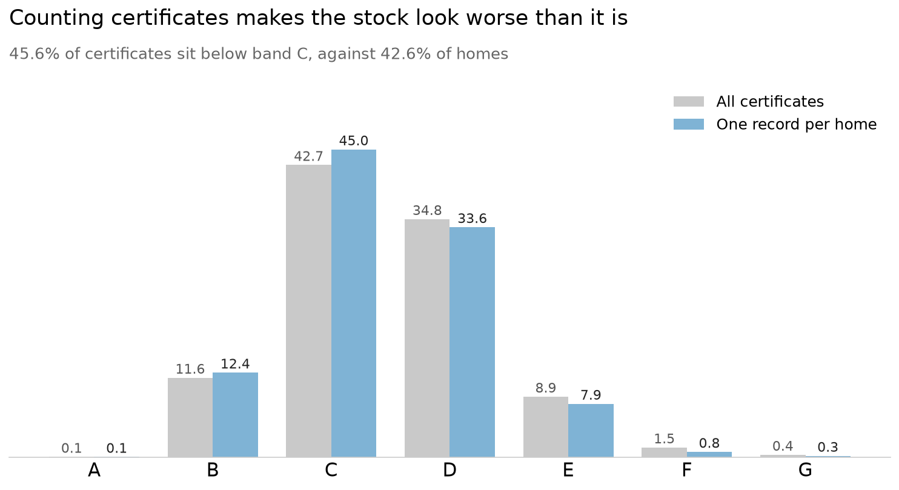
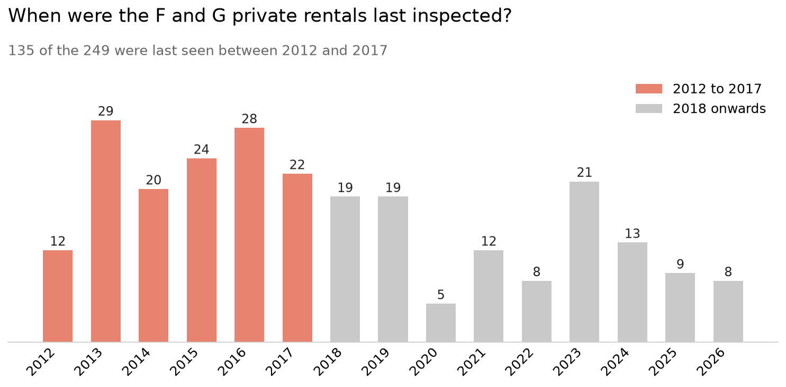
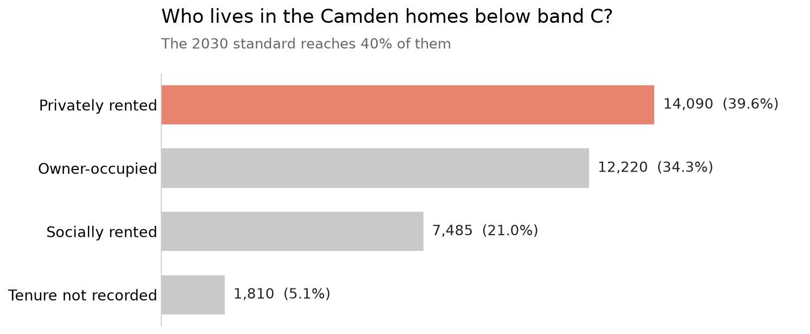
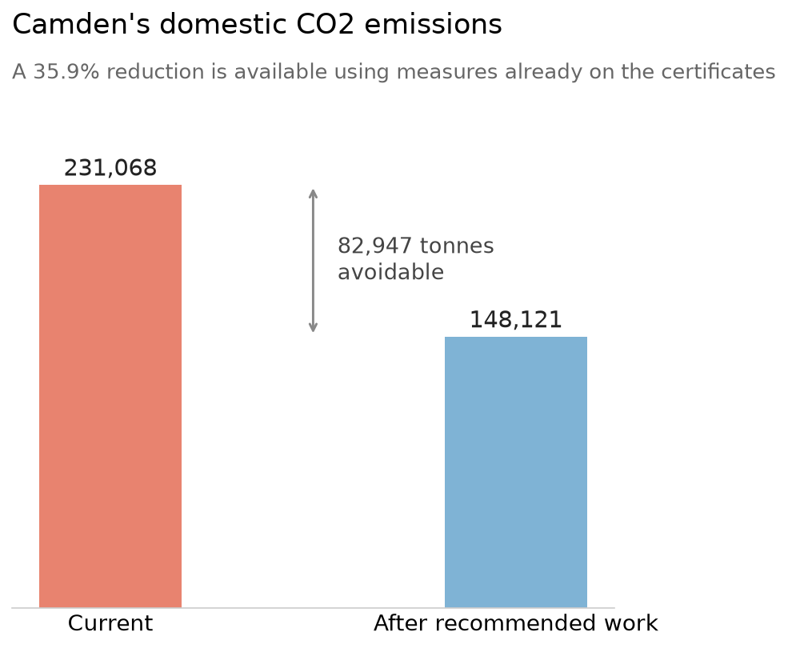

# EPC Data Quality Audit: Camden, London

An independent audit of 102,185 domestic Energy Performance Certificates, and what happens when the data is used the way it is published.

249 Camden homes are recorded as privately rented and rated F or G, which is unlawful to let without an exemption. More than half were last inspected between 2012 and 2017, twice the staleness of the register overall. Nothing in the register can tell you whether those homes were fixed or simply never looked at again.

## What this is

A data quality audit of the domestic EPC register for Camden, London, covering 102,185 certificates lodged between 2012 and 2026. It profiles the raw data against four quality dimensions, cleans it without deleting anything, and then analyses the result to show which conclusions the cleaning changes and which it only tidies.

The findings are not a list of typos. They are the specific ways this data misleads anyone who uses it as published: for enforcing the rental energy standard, for tracking housing stock, or for net zero planning.

Where the register enforces a rule, it holds without exception. The rating letter matches its numeric score in 100% of records. Where it does not, homes of 3 m2, certificates lodged before the inspection that produced them, and negative CO2 emissions enter the data and stay there for a decade, unflagged.

## The data

An Energy Performance Certificate rates a home's energy efficiency from A, best, to G, worst. Every home sold, rented, or newly built in England and Wales needs one. The certificates are published as open data by the Ministry of Housing, Communities and Local Government.

This audit uses the full domestic extract for Camden: 102,185 certificates, lodged between January 2012 and June 2026, describing roughly 83,675 distinct homes. Camden was chosen for its mix of stock, from Victorian terraces to postwar estates to new build, and for its high share of both private and social rental.

Source: get-energy-performance-data.communities.gov.uk

The data itself is not in this repository. See "Running it yourself" below.

## What the audit found

### Counting certificates is not counting homes

The file holds every certificate ever lodged, and homes are recertificated on sale or re-let, so a home can appear many times. Count the file as downloaded and 45.6% of Camden sits below band C. Keep only the most recent certificate per home and it is 42.6%.

The gap runs in one direction. Every band below C is overstated and every band above C except A is understated. F almost halves, from 1.5% to 0.8%. Superseded records preserve the home as it was before the work was done, so the raw file does not only double count, it makes the housing stock look worse than it is.

The 83,675 figure carries one uncertainty of its own. Homes without a property identifier are matched on address alone, and 175 of them share an address with a home that does have an identifier, so a small number may still be counted twice. That is a ceiling rather than a count, and at most 0.2% of the total.

### The enforcement list is a list of homes nobody has looked at

249 Camden homes carry a current certificate recorded as privately rented and rated F or G, which is unlawful to let without a registered exemption. 54.2% of them were last inspected between 2012 and 2017, against 27.2% of Camden certificates overall, so they are twice as stale as the register's own baseline.

Two explanations fit equally well: the homes are still F or G and have not been checked, or they were improved and never recertificated. Nothing requires a new certificate after improvement work, and the register has no record status, so it cannot distinguish the two. A regulator working from this list would be acting on properties whose current condition is unknown.

Both the rating and the tenure describe the home as it was at its last inspection, so the list identifies homes that were privately rented and failing when someone last looked, not homes that are today.

### 42.6% below band C, but the law reaches 40% of it

35,605 homes fall below band C, the standard privately rented homes must reach by 2030. Of those, 14,090 are privately rented, 12,220 owner-occupied and 7,485 socially rented, so the enforceable problem is roughly 14,000 homes rather than 35,605. A further 1,810 cannot be assigned to any tenure at all, because it is recorded as unknown or left blank.

Tenure is recorded at inspection and never maintained. Across homes with more than one usable tenure record, 36.5% show a different tenure between records, so even the 14,090 describes what was true when someone last looked.

### The carbon case is strong and the household case is not

Camden's homes emit 231,068 tonnes of CO2 a year and could emit 148,121, a saving of 82,947 tonnes or 35.9%, using measures already written on the certificates. The figure holds when the flagged floor areas are excluded, so it does not rest on records the audit found fault with. It does assume every recommendation is carried out on every home, which no programme achieves, and the potential figure is the assessor's estimate rather than a measured result.

Getting there is a heating problem before it is an insulation one: 80.4% of homes run on gas, and close to 20% are on a community network and cannot change their heating individually at all. And the certificates undercut their own recommendations. The median saving is £140 a year, and 19.2% of homes gain nothing or are made worse off by doing the work their certificate recommends.

Each certificate prices its recommendations at the energy costs of the year it was lodged, so those figures show the direction of the effect rather than a current bill. The 19.2% is also the conservative reading: homes with no recorded fuel are excluded, and they are 92.2% zero-change, so including them takes it to 25.8%.

## How it was done

Three notebooks, run in order.

- `notebooks/01_data_profiling.ipynb` profiles the raw extract across four quality dimensions: completeness, uniqueness, validity and consistency. It documents 9.1% of certificates with no property identifier, one identifier covering 69 separate flats, floor areas from 3 m2 to 3,337 m2, negative CO2 emissions, and 1,100 certificates lodged before the inspection that produced them, all clustered at roughly 90 days in 2012 to 2014.
- `notebooks/02_data_cleaning.ipynb` cleans without deleting. Every original row and column is kept and 23 columns are added alongside them, so any cleaning decision can be inspected against the original and disagreed with.
- `notebooks/03_data_analysis.ipynb` analyses the result, and ends by testing whether the cleaning changed the conclusions or only tidied them.

`outputs/data_quality_report.md` is the formal write-up: seven findings, each rated Critical to Low, with what it affects and what would fix it. One Critical, two High, three Medium, one Low. The ratings are by impact on what the register is for, not by how many records are affected, which is why the absence of any record status outranks defects sitting in far more rows. The recommendations are split into what the register team could change and what anyone using the data today should do about it.

One finding in that report was wrong, and the withdrawal is published at the top of the report rather than quietly edited out. An early conclusion held that the register had lost the ability to distinguish private from social rentals after 2012. It had not: the information moved to another column that was never checked against it. The finding was rewritten around what is actually wrong, demoted from Critical to High, and the same correction is marked in the profiling notebook.

## Running it yourself

The EPC data is not in this repository. It is licensed open data and is not redistributed here.

To reproduce:

1. Download the Camden domestic extract from get-energy-performance-data.communities.gov.uk
2. Save the certificates file as `data/raw/camden_certificates.csv`
3. Run the notebooks in order

The code in this repository is MIT licensed. The EPC data has its own licence and remains with the publisher.

Requires Python 3, pandas, numpy and matplotlib.

## Author

Tareq Asaad, MSc Data Science, University of Aberdeen.

[LinkedIn](https://www.linkedin.com/in/tareq-asaad) | [t.asaad@outlook.com]

Findings from this audit are being shared with the register team at MHCLG.